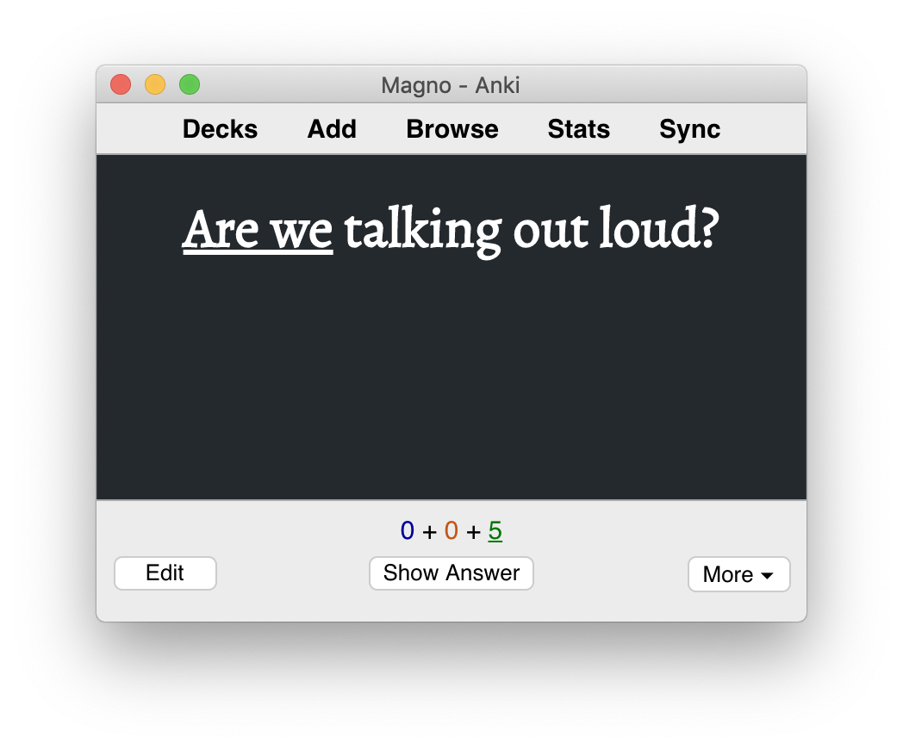

[](https://apps.ankiweb.net/)

# My Anki

> Powerful, intelligent flash cards. Remembering things just became much easier.

## [Template](https://apps.ankiweb.net/docs/manual.html#basic-templates)



### Front Template

```html
<strong>{{ Front }}</strong>
```

### Back Template

```html
{{ FrontSide }}

<hr>

{{ Back }}
```

### Styling

```css
@import url('https://fonts.googleapis.com/css?family=Alegreya');

body {
	background: #24292e;
}

hr {
	height: 0;
	display: block;
	border: 0;
	text-align: center;
	overflow: visible;
	margin-top: 2em;
	margin-bottom: 1.375em;
}

hr:before {
	content: '...';
	display: inline-block;
	margin-left: .6em;
	position: relative;
	top: -1.875em;
	font-size: 1.875em;
	letter-spacing: .6em;
}

.card {
	font-family: 'Alegreya', 'Times New Roman', serif;
	font-size: 2em;
	text-align: center;
	color: #fff;
}
```

## [Backup](https://apps.ankiweb.net/docs/manual.html#backups)

### File Locations

- macOS `~/Library/Application Support/Anki2`
- Linux `~/.local/share/Anki2`
- Windows `%APPDATA%\Anki2`

## Troubleshooting

### Sound and video on cards will not function until mpv or mplayer is installed.

```bash
sudo apt install -y mpv
```
